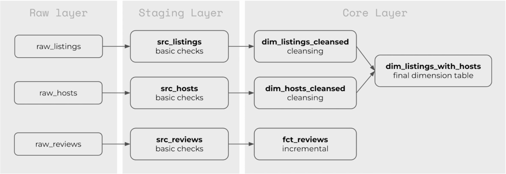
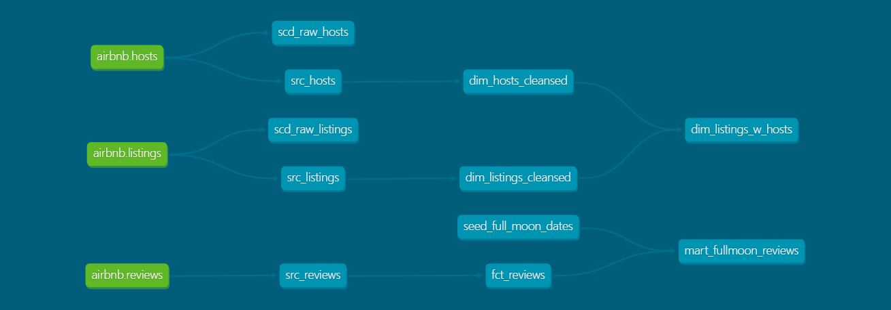
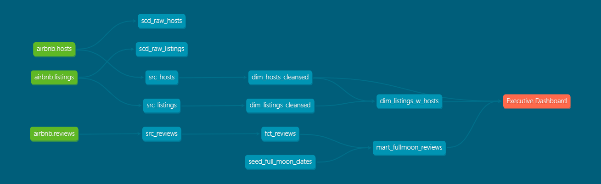
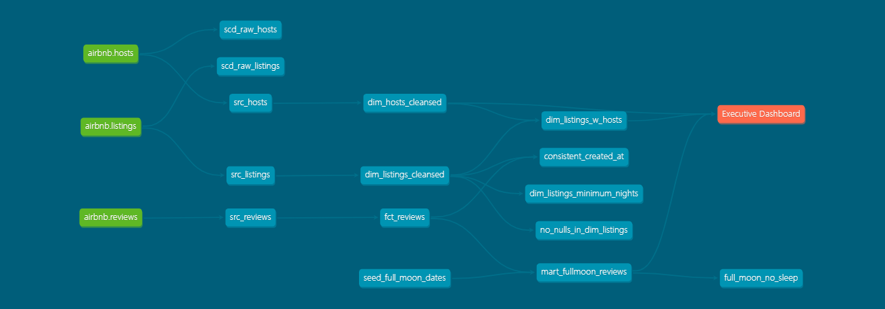

# Analytics Engineering Airbnb

This use case presents a project to simulate an Analytics Engineering solution for the Airbnb operation in the city of Berlin. This use case will present processes of loading, cleansing and exposing your data. It will also explore testing, automations and documentation processes.

**Data Source:** Inside Airbnb - Berlin

**Tech Stack:**

 

 

 

**Input Data Model**

 

**Data Flow Progress**

 

**DBT Simplified DAG**

 

**DBT Solution DAG**

 

**Data Flow Overview**

 

